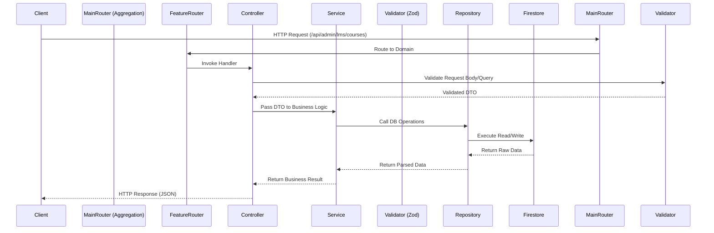
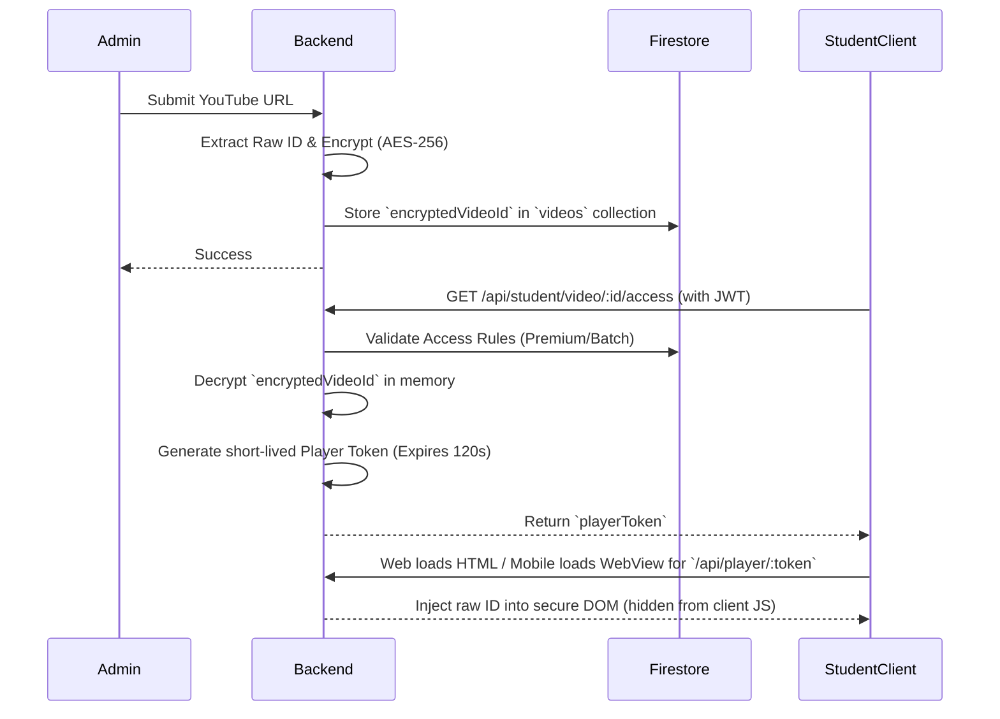
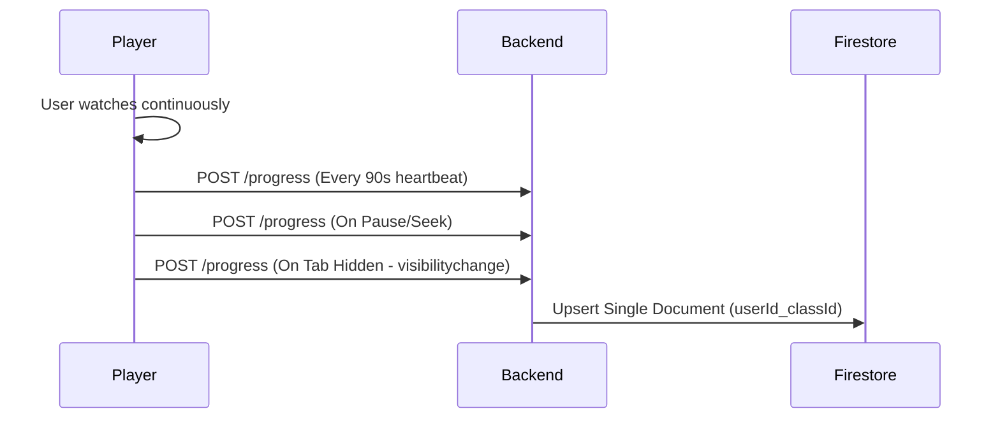
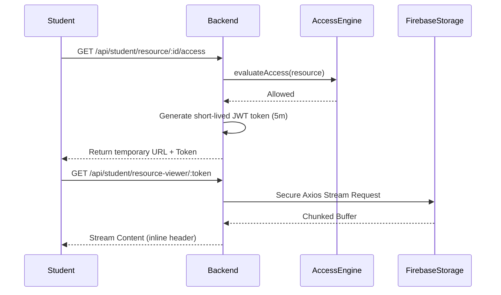
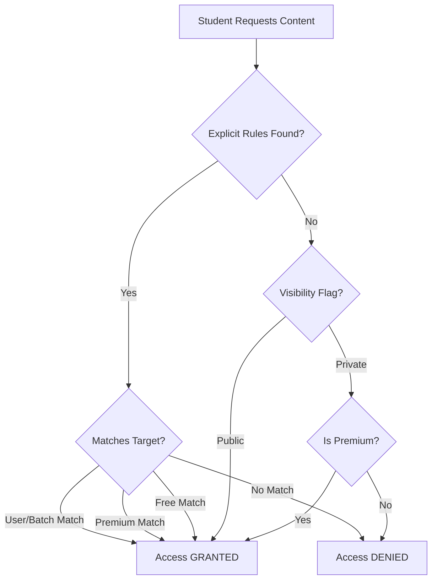
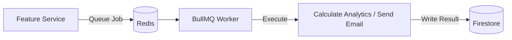

# NERMAI Academy - Complete Architecture, Data Flow & Progress Report

**Version**: 2.0 (Final Architecture Review)  
**Status**: Live Tracking & Documentation  
**Purpose**: A comprehensive master document detailing the complete working mechanics, system architecture, data flow pipelines, and development progress of the NERMAI Academy platform.

---

## 1. Executive Summary & Technology Stack

NERMAI Academy is a robust, multi-platform Learning Management System (LMS) and CRM designed to deliver secure educational content to students while providing powerful administrative tools for teachers.

**Monorepo Structure**: The project is structured as a monorepo containing a shared backend, shared libraries, and separate frontend applications for web and mobile.

### Tech Stack
- **Backend**: Node.js, Express, TypeScript
- **Database**: Firebase Firestore, Firebase Admin SDK
- **Caching & Queues**: Redis, BullMQ
- **Shared Libraries**: `@nermai/api` (Axios API SDK), `@nermai/types` (Shared Zod schemas & TS types)
- **Web App (`apps/web`)**: React (Expo Web), Material UI, Framer Motion
- **Mobile App (`apps/mobile`)**: React Native (Expo SDK), React Navigation (Bottom Tabs, Native Stack), React Native Gesture Handler, Moti (Animations)

---

## 2. Universal Data Flow Architecture (Backend)

The backend strictly adheres to a **Domain-Driven Repository Pattern**. Data flows in a unidirectional manner to prevent cross-domain pollution and ensure isolated database logic.

### 2.1 Standard API Request Flow

**Architectural Rules:**
- **Controllers** never talk to Firestore directly. They only handle HTTP layers.
- **Services** orchestrate business logic but never touch the DB.
- **Repositories** are the ONLY layer interacting with Firestore.
- **Validators (Zod)** ensure incoming data is strictly typed before processing.

---

## 3. Frontend Architecture

### 3.1 Web Application (`apps/web`)
- **Admin Portal**: Complex table-based layouts, drag-and-drop course builders, and detailed analytics dashboards.
- **Student Portal**: Secure video consumption, resource downloads, and progress tracking.

### 3.2 Mobile Application (`apps/mobile`)
- **Mobile-First Paradigm**: The mobile app does not simply mirror the web app. It uses native UI components.
- **Admin Navigator**: Utilizes a 5-Tab `@react-navigation/bottom-tabs` structure (`Dashboard`, `LMS`, `Students`, `Assistant`, `More`).
- **Touch Interactions**: Utilizes `react-native-gesture-handler` for swipe-to-edit course cards, and native bottom `ActionSheets` for contextual CRM actions (e.g., managing a student's password or batch).
- **Offline Resiliency**: `@tanstack/react-query` is configured to cache API requests, allowing admins to safely browse content offline. Safe edits are queued and synced upon reconnection.
- **File Uploads**: Integrates `expo-document-picker` for seamless PDF/PPT uploads directly from iCloud/Google Drive.

### 3.3 Cross-Platform Parity Principle (The "Web-Replicated" Law)
**Goal:** 100% functional parity between React Web and React Native with **zero business logic duplicated** on the frontend.

**The Golden Rule**: Every business rule, API contract, access rule, attendance policy, lifecycle state, analytics flow, notification behavior, and security mechanism **must be centralized in the backend**. The frontends simply consume `@nermai/api` and `@nermai/types`. 

Only **presentation layers** and **platform-specific APIs** may differ to leverage the native strengths of the underlying OS:
- **Video Delivery**: Web uses `iframe` | Native uses `WebView`
- **PDF Viewer**: Web uses `react-pdf` | Native uses `react-native-pdf`
- **Background State (Attendance)**: Web uses `visibilitychange` (Document) | Native uses `AppState` (Background/Active)
- **Local Storage/Offline Queue**: Web uses `IndexedDB` or `LocalStorage` | Native uses `SQLite`
- **File Downloads**: Web relies on browser cache | Native relies on encrypted `expo-file-system` cache
- **Screenshot Protection**: Web uses visual deterrents (watermarks, right-click block) | Native uses hard block via `expo-screen-capture`
- **Push Notifications**: Web uses Browser Push | Native uses FCM / Expo Notifications with Deep Linking
- **Back Navigation**: Web uses Browser Back | Native uses Android `BackHandler`

Never duplicate Attendance Logic, Analytics, Lifecycle, or Security mechanisms into the frontend repositories.

---

## 4. Specific Module Data Flows

### 4.1 Recorded Video Delivery (Anti-Piracy Streaming)

The platform prevents students from accessing raw YouTube IDs to protect intellectual property.

**Security Deterrents**: 
- **Web**: Prevents `F12`, `Right-Click`, and injects floating Watermarks (IP, Name, Time).
- **Mobile**: Uses secure `react-native-webview` rendering the proxy HTML, naturally preventing DOM inspection.

### 4.2 Smart Watch Checkpoints & Dynamic Attendance

Watch progress is not blindly polled. Instead, progress is explicitly synced to Firestore based on adaptive user events to reduce DB costs.

### 4.3 Private Note Proxy Streaming (Resource Delivery)

Resources (PDFs/Notes) must hide the raw Firebase Storage URL to prevent direct sharing.

### 4.4 Content Filtering & Access Rules Engine

This logic is used universally by Videos, Resources, and Live Sessions.

### 4.5 Offline Analytics (BullMQ & Redis)

For intensive operations like sending CRM campaigns or aggregating watch times, the platform uses an asynchronous queue.

---

## 5. Current Database Structure (Modules)

### 5.1 Students Module
- **students** (Collection)
  - `id` (string): Maps to Firebase Auth UID
  - `tenantId` (string)
  - `email`, `displayName`, `phoneNumber`, `photoURL`, `rollNo` (string)
  - `status` ('active' | 'inactive' | 'suspended')
  - `programMemberships`: Array of `{ batchId, joinedAt, status }`
  - `role`, `fcmToken`, `accessTier` (string)
- **enrollments** (Collection)
  - `id`, `studentId`, `courseId`, `tenantId`, `enrollmentDate`, `validUntil`
  - `status` ('active' | 'completed' | 'dropped' | 'suspended')
  - `progressPercentage` (number)
- **batches** (Collection)
  - `id`, `tenantId`, `name`, `courseId`
  - `maxCapacity`, `currentEnrollment` (number)
  - `startDate`, `endDate`, `status`

### 5.2 Courses Module (Hierarchical)
- **courses** (Collection)
  - `id`, `tenantId`, `name`, `description`
  - `price` (number)
  - `visibility` ('public' | 'private' | 'restricted')
- **subjects** (Collection)
  - `id`, `courseId`, `name`, `order` (number)
- **topics** (Collection)
  - `id`, `subjectId`, `name`, `order` (number)
- **classes** (Collection)
  - `id`, `topicId`, `title`, `teacherId`, `order`
  - `classType` ('youtube_recorded' | 'youtube_live' | 'zoom_live')
  - `accessLevel` ('free' | 'premium' | 'batch')
  - `encryptedVideoId`, `encryptedRecordingId`, `meetingUrl` (string)
  - `scheduledStartTime`, `actualStartTime`, `actualEndTime` (ISO strings)
  - `attendance`: Object with `mode`, `value`, `version`, `lockAfterStart`, `allowEditBeforeStart`
  - `expectedDurationMinutes`, `extensionMinutes` (number)

*(Note: All documents automatically inherit `createdAt`, `updatedAt`, `createdBy`, and `updatedBy` fields from `BaseAuditFields` for strict audit logging)*

---

## 6. Project Progress Tracker

### Phase 1: Core Initialization & Setup
- [x] Backend Project Initialization (Node.js, Express, TypeScript)
- [x] Shared Libraries (`@nermai/api`, `@nermai/types`)
- [x] Firebase Admin SDK, Redis, BullMQ Initialization
- [x] Frontend Web & Mobile Initialization (Expo Monorepos)

### Phase 2: LMS Module
- [x] Course Management (CRUD courses, subjects, topics, classes)
- [x] Notes Upload & Learning Resources (expo-document-picker)
- [x] Content Filtering & Access Rules

### Phase 3: Video Streaming & Live Classes
- [x] Secure Video Token Proxy (AES-256 + Redis Mapped)
- [x] Frontend Video Player Architectures (Web Iframe & Mobile WebView)
- [x] Frontend Security Guard Suite (Watermark/No Copy)
- [x] Dynamic Attendance Tracking

### Phase 4: CRM Module
- [x] Native ActionSheets for Student Management (Mobile)
- [x] AI Chatbot Integration
- [x] Student Analytics

### Phase 5 & 6: Dashboards, Mobile Native Build & Polish
- [x] Web Admin Dashboard (Metrics & Overview)
- [x] Mobile Admin Dashboard (Actionable Widgets, Swipe-to-Edit, 5-Tab Navigation)
- [x] Custom Expo Development Build (Successfully compiled Native Android App with AES, MMKV, Reanimated, and Worklets engines)
- [x] Offline UI Caching & Safety (React Query)
- [x] Verification across Web, Android, iOS.
